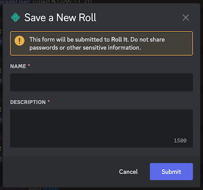
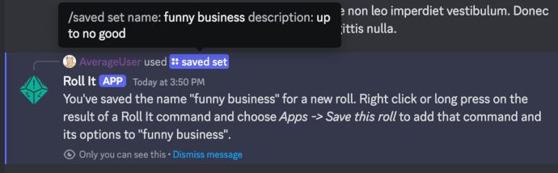
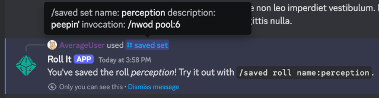

# Saving Rolls

Most rolls can be saved for later re-use by giving them a name and a description. This is done using the `/saved` family of commands. Here's a primer on how the whole thing works, as reproduced from the output of [`/help topic:Saved Rolls` invocation].

# Saving a Roll

When you need to use a complicated roll over and over again, Roll It can save that roll so you don't have to type out (and remember) the whole thing each time. In order to save a roll, you need three parts:

1. A name for the saved roll. This is how you will find it if you save more than one, so the name has to be unique.
2. A description for the saved roll. This should describe what the roll does, and will be shown as the default description each time you use that saved roll.
3. The command and its options. This does the actual rolling, so it's super important.

In order to save all this, Roll It uses a pair of commands. The first is a normal slash command, `/saved set`, which stores the name and description. The second is a context command (more on those in a moment) named _Save this roll_, which stores the command and its options. That's it! Once you've saved all three parts, you're ready to use your saved roll.

You can save the parts of a new roll in any order. You can start with _Save this roll_ if you realize you want to save the roll you just made, or with `/saved set` if you have a name in mind first. Roll It will save one incomplete command at a time for you to finish up later.

## Starting With a Command

_Save this roll_ is the first context command in Roll It, so it might need some explaining. A context command is a bot action that is not typed out, but is used through a menu within Discord. To get to that menu, you need to take different steps depending on whether you're using Discord on your phone or on a computer. With a phone, you long-press on a message to show the menu. On a computer, you right-click the message. Once that context menu shows up, you select the `Apps` item and a smaller menu opens up. That's where you can find _Save this roll_.

_Save this roll_ lets you save a command that you've just used. To do so, use _Save this roll_ on the message with that command's results. It will read that result message and save the command and options that were used to create it. Then, it will prompt you to take the next step and use `/saved set` to finish up your saved roll with a name and a description.

#> For an example, let's say you used [`/roll pool:2 sides:6` invocation] and Roll It replied with `@you rolled 9 (2d6: [5,4])`. By long pressing or right clicking on `@you rolled 9 (2d6: [5,4])`, you select `Apps` and then _Save this roll_. Roll It reads the message and determines that you used the `/roll` command with a `pool` of 2 and `sides` of 6. It saves that, and tells you to run `/saved set` to save the name and description. Once you do, you can use your roll!

?> Not all commands can be saved. Some do not roll actual dice (like `/table roll` or `/help`), or don't have re-usable options (like `/coin`), or are so simple that it's more effort to use a saved roll than to just use the options.

Here are the commands that can be saved:
* `/curv` - Roll 3d6 for D&D 5e
* `/d6` - Roll some six-sided dice
* `/2d6` - Roll two six-sided dice (accelerator for `/d6`)
* `/d10` - Roll a single ten-sided die
* `/d100` - Roll a single percentile (100-sided) die
* `/d20` - Roll a single 20-sided die
* `/drh` - Roll pools of d6s for Don't Rest Your Head
* `/fate` - Make a FATE roll of four fudge dice
* `/kob` - Roll an exploding die for Kids On Bikes
* `/nwod` - Roll a pool of d10s using rules for New World of Darkness
* `/roll-formula` - Roll a combination of dice and complex modifiers
* `/roll` - Roll a set of plain dice
* `/shadowrun` - Roll a pool of d6s for Shadowrun
* `/wod20` - Roll a pool of d10s using rules for World of Darkness 20th Anniversary

!> It is not possible to save secret rolls. If you want to save something, it has to be publicly visible. This is because Discord does not show a context menu for secret messages, so those messages can never be sent to *Save this roll*.

## Starting With a Name

As noted, you can also begin making a new saved roll with `/saved set` and supplying a `name` and `description`. `/saved set` will reply with instructions to use _Save this roll_ to save the command and options. Once you do, your roll is ready to go!

!> The name of the roll has a single special limitation: you, personally, cannot have two rolls in the same server with the same name.

## Advanced Usage: The Invocation

So far we've assumed that you're using both `/saved set` and _Save this roll_ in order to build your saved commands. But what if you're a power user in a rush? Well, `/saved set` has you covered. It has an advanced third option called `invocation` which lets you save a command and its options alongside the name and description for the saved roll. The only catch is that you have to type the whole command manually in a specific format, remembering the option names and everything. That's why I suggest using the _Save this roll_ command instead of entering an `invocation`.

The format for an invocation looks like [`/command option:value` invocation]. So for example, [`/roll pool:2 sides:6` invocation] or [`/wod20 pool:7 difficulty:6 specialty:true` invocation] are both valid invocations. When you supply an invocation along with a name and description, the saved roll is complete and you can use it right away.

# Rolling It

Once you have a saved roll, you can start using it with `/saved roll`. It takes the name of a saved roll and runs the command and options you stored. It also takes a `bonus`, which lets you add to the command's options on the fly. See the help for `/saved roll` to learn more.

You can see the rolls you've saved by using the `/saved list` command. That will also warn you if you have an unfinished roll, or one whose options are no longer valid. In either case, you'll have to update the roll in order to use it.

So how do you update a saved roll? By using `/saved manage` or `/saved grow`! The `/saved grow` command lets you make small changes to a roll to keep it in sync with a character sheet. The more involved `/saved manage` lets you remove or edit a roll as needed. See the help for`/saved grow` and `/saved manage` to learn more.
