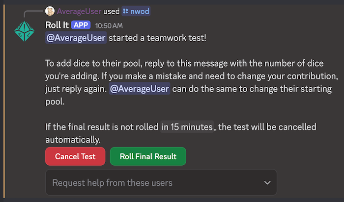
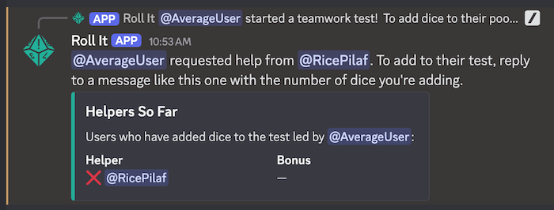
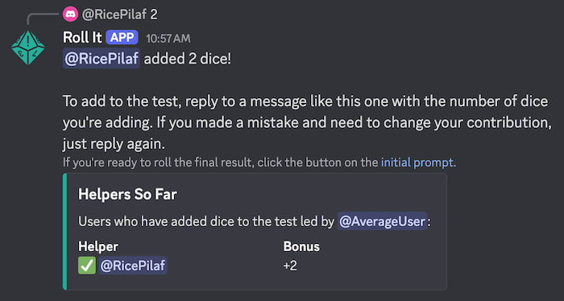
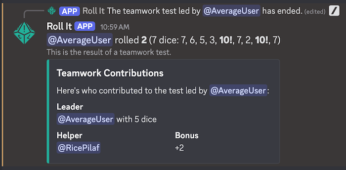

# Teamwork Tests

Most systems have some way for other players to try and help out with a large or complex task. This is usually straightforward, like adding a static bonus. Some systems are more complicated than that.

First added for the *New World of Darkness* system, the special `teamwork` mode makes it easy to collect the contributions of multiple helpers so that the leader can roll the final pool. The general mechanic is that helpers roll their own dice pool for the group action, and each success they score adds a die to the leader's final dice pool. When they're ready, the leader rolls that final pool.

When a teamwork test begins, Roll It will show a prompt asking for contributions and offering a few controls to the test leader.

The leader can cancel the teamwork test or roll the final result at any time. They can also request that specific people help with the test. Requested helpers are shown with a ✅ or a ❌, depending on whether they've added dice yet.

At this point, helpers can make their own rolls to see how many dice they contribute to the group effort. Anyone can contribute by replying to the prompt, or to any message with a helper summary. Roll It will use the first number in the message as that user's contribution. 

When the test is rolled, the final result will be displayed as appropriate for the dice system.

## Supported Systems

Most dice systems do not use this particular kind of teamwork test, so it's only supported by the rollers that need it. Here are the commands that allow teamwork tests:

* `/nwod` - Roll a pool of d10s using rules for [New World of Darkness](/systems/nwod)
* `/shadowrun` - Roll a pool of d6s for [Shadowrun](/systems/shadowrun)
* `/wod20` - Roll a pool of d10s using rules for [World of Darkness 20th Anniversary](/systems/wod20)
