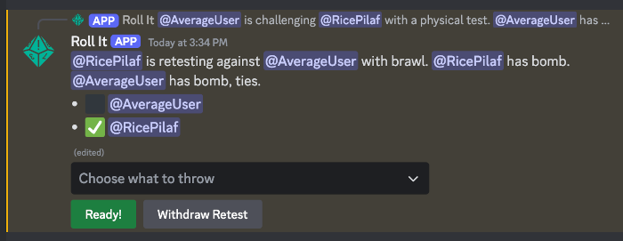

# World of Darkness Revised MET

*This game is out of print. Find related material at [By Night Studios](https://bynightstudios.com/)*

The Mind's Eye Theatre system makes use of two commands, `/met static` and `/met opposed`.

The `/met static` command lets a user throw a rock-paper-scissors chop against a randomly-rolling opponent, suitable for static and simple tests. It can roll many such tests at once, which is handy for streamlining ST rolls or group actions.

The `/met opposed` command is much more involved and starts an interactive opposed challenge against a named user. Each participant has a chance to choose what they throw and retest multiple times -- with cancels -- in order to resolve the challenge.

?> The old `/chop` command is just a shortcut for `/met static`.

## `/met static`

Compare the user's throw against a randomly generated rock-paper-scissors throw.

* `throw` is the symbol you want to use. Can be random or chosen specifically from one of rock, paper, bomb, or scissors. Default is random rock-paper-scissors.
* `vs` is the set of symbols your virtual opponent should pick from. The default is random rock, paper, or scissors, but you can set this to random rock, bomb, or scissors to represent a more dangerous opponent. You can also set `vs` to `None`, in which case only your own symbol is shown.

<!-- panels:start -->
<!-- panels:title -->
Example:
<!-- div:left-panel -->
```invocation
/met static
```
<!-- div:right-panel -->
<@user> rolled **win** (:rock: rock _vs_ :scissors: scissors)
<!-- panels:end -->

## `/chop`

The `/chop` command is a shortcut to `/met static` with simplified options. It defaults to displaying a single random symbol.

* `static` is whether to show your result against a virtual opponent
* `bomb` is whether to pick randomly from rock/bomb/scissors instead rock/paper/scissors

<!-- panels:start -->
<!-- panels:title -->
Example:
<!-- div:left-panel -->
```invocation
/chop
```
<!-- div:right-panel -->
<@user> rolled :rock: rock
<!-- panels:end -->

## `/met opposed`

Start an interactive challenge against another user.

* `opponent` is the user you wish to challenge
* `attribute` is the attribute used to determine total traits. One of Mental, Social, or Physical.

Example:

```invocation
/met opposed opponent:@RicePilaf attribute:Physical
```

One of the major conveniences of `/met opposed` is that it summarizes the results of each roll in the challenge at every step, making it easy to keep track of how things are going. However, it uses lots of buttons and drop-downs to do so. Since Discord sometimes does not send button clicks and selections to Roll It, this command can break more easily than most. One of the best ways to work around that problem is to minimize how long Roll It has to wait between interactions. Being in voice chat with the other participant can help keep retests moving, or simply being attentive during the challenge.

?> Since Discord interferes so much with `/met opposed`, please use `/help feedback` whenever it breaks and describe what you were doing with it so I can have a better chance of tracking down the issue.

Once you send the command, Roll It will prompt your opponent to choose their own benefits (bomb, ties, and cancels) and pick the symbol they want to use against your first chop. If they have the `bomb` advantage, then bomb options will be available to them. They can also immediately relent to the test at this stage.


?> If you tagged the wrong opponent, or realize you don't need a challenge after all, you can cancel the whole thing from this prompt.

After your opponent sends their symbol, Roll It will show a status message detailing the state of the challenge. This includes details of the challenge like its attribute and default retest ability, as well as a history of tests that have been made.


The user who is currently losing can concede from here. If you both are truly tied, then *either* player can concede. Regardless of ties, either player can retest the current result.

?> `/met opposed` accounts for the declared `ties` advantage of both players when it determines who is winning a given test. If both symbols match, but one player has ties, then they will be declared the leader. If the symbols match and *both* have ties (or neither has ties), then the outcome will be a true tie and treated a little differently.

If the losing player concedes, the test is over and Roll It will show a simple message with the final winner:


If they retest, then one of two things can happen: a cancel prompt, or a retest prompt.

Let's say you're winning and your opponent retests with an ability. If you haven't yet used an ability to start or cancel a retest, then Roll It will prompt you to choose whether you want to cancel your opponent's retest. If you *have* used an ability to start or cancel a retest, then the prompt will not be shown. Similarly, if your opponent retests with an item or something else besides an ability, the cancel prompt will not be shown, as these tests cannot normally be cancelled.

?> Due to limitations in Discord, you cannot write in which ability, item, merit, etc. you are using. Instead, you have to pick a category for the retest reason and cancel reason. If the specifics are important, confer about it with your opponent or STs separately from Roll It.

If you have the `cancels` advantage, the cancel prompt will be shown for *every* retest started by your opponent, regardless of what you've already used.

!> Roll It does not police the order or uniqueness of retests. You and your opponent or ST have to manage which retest reasons are valid separately from Roll It.


If you cancel the retest, Roll It will show a new status message with the attempted retest and its cancelled status:


If you do not cancel, then the retest prompt will be shown. Here you and your opponent each choose a new symbol:



The retest prompt simply lets you and your opponent choose a new symbol. Once you both do so, Roll It shows a new status message so you know where things stand.

?> If you're the one who started a retest, you can withdraw that retest in either the cancel prompt or the retest prompt. This can be useful if you realize the retest was in error, used the wrong ability, etc.

The status after a completed retest:


